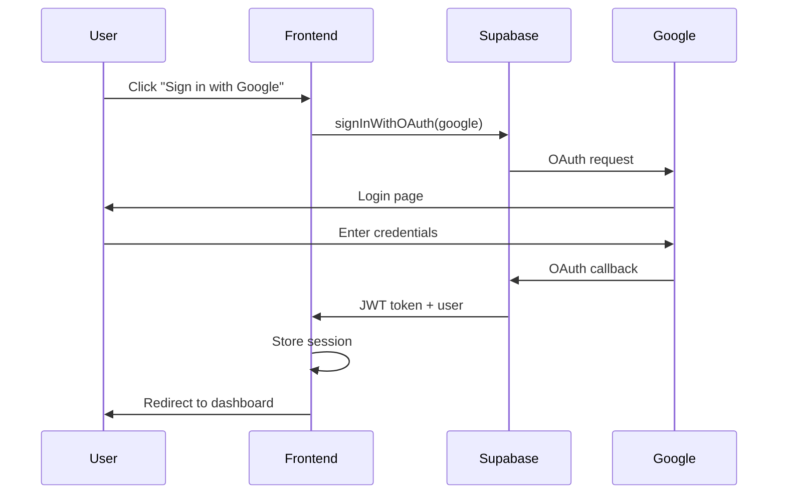
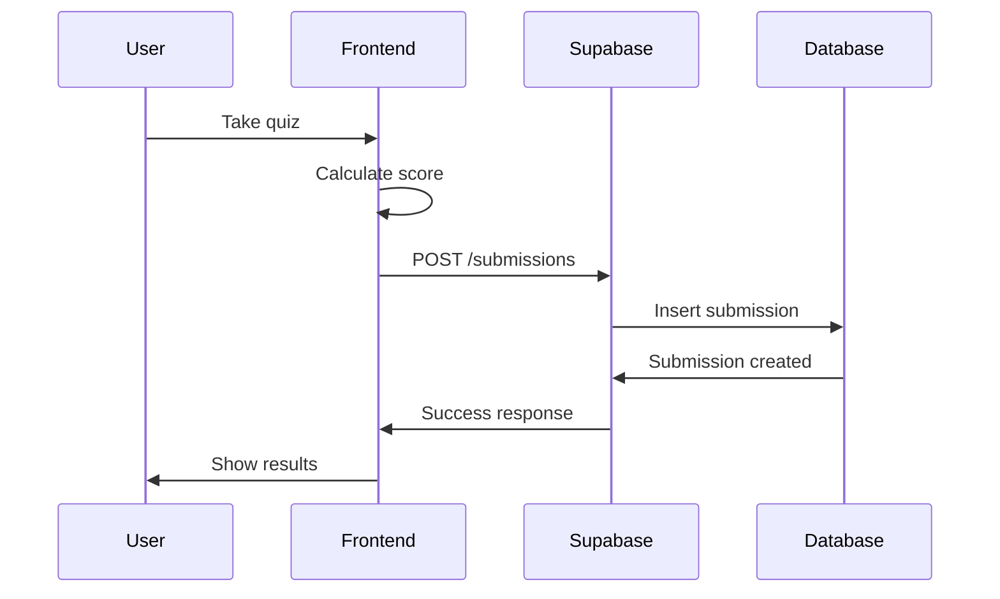

# API Documentation

## Overview

This folder contains backend API documentation for the Virtual Lab ITB application.

**⚠️ Backend Status:** Not yet implemented  
**Stack:** Supabase (PostgreSQL + REST API + Realtime)

---

## Documentation Structure

```
docs/api/
├── README.md                    ← You are here
├── authentication.md            ← Auth endpoints & flows
├── challenges.md                ← Challenge CRUD operations
├── submissions.md               ← Submission endpoints
├── users.md                     ← User management
└── error-handling.md            ← Error codes & handling
```

---

## Quick Start

### Base URL

```
Production: https://your-project.supabase.co/rest/v1
Local: http://localhost:54321/rest/v1
```

### Authentication

All API requests require authentication via Supabase JWT token:

```http
Authorization: Bearer <JWT_TOKEN>
apikey: <SUPABASE_ANON_KEY>
```

### Common Headers

```http
Content-Type: application/json
apikey: your-supabase-anon-key
Authorization: Bearer user-jwt-token
```

---

## API Endpoints Overview

### Authentication
- `POST /auth/v1/signup` - Sign up new user
- `POST /auth/v1/token?grant_type=password` - Sign in
- `POST /auth/v1/logout` - Sign out
- `GET /auth/v1/user` - Get current user
- `POST /auth/v1/token?grant_type=refresh_token` - Refresh token

### Challenges
- `GET /rest/v1/challenges` - Get all challenges
- `GET /rest/v1/challenges?id=eq.<id>` - Get challenge by ID
- `POST /rest/v1/challenges` - Create challenge (admin)
- `PATCH /rest/v1/challenges?id=eq.<id>` - Update challenge (admin)
- `DELETE /rest/v1/challenges?id=eq.<id>` - Delete challenge (admin)

### Submissions
- `GET /rest/v1/submissions` - Get user submissions
- `POST /rest/v1/submissions` - Submit challenge answers
- `GET /rest/v1/submissions?id=eq.<id>` - Get submission by ID

### Users
- `GET /rest/v1/users?id=eq.<id>` - Get user profile
- `PATCH /rest/v1/users?id=eq.<id>` - Update user profile

---

## Database Tables

### users
```sql
id          UUID PRIMARY KEY
email       TEXT UNIQUE NOT NULL
name        TEXT NOT NULL
created_at  TIMESTAMP WITH TIME ZONE
```

### challenges
```sql
id          TEXT PRIMARY KEY
title       TEXT NOT NULL
description TEXT NOT NULL
category    TEXT NOT NULL
difficulty  TEXT CHECK (difficulty IN ('Easy', 'Medium', 'Hard'))
total_points INTEGER NOT NULL
questions   JSONB NOT NULL
created_at  TIMESTAMP WITH TIME ZONE
```

### submissions
```sql
id          UUID PRIMARY KEY
user_id     UUID REFERENCES users(id)
challenge_id TEXT REFERENCES challenges(id)
score       INTEGER NOT NULL
answers     JSONB NOT NULL
submitted_at TIMESTAMP WITH TIME ZONE
UNIQUE(user_id, challenge_id)
```

---

## Row Level Security (RLS)

### users table
```sql
-- Users can read their own data
SELECT: user_id = auth.uid()

-- Users can update their own data
UPDATE: user_id = auth.uid()
```

### challenges table
```sql
-- Everyone can read challenges
SELECT: true

-- Only admins can insert/update/delete
INSERT/UPDATE/DELETE: false
```

### submissions table
```sql
-- Users can read their own submissions
SELECT: user_id = auth.uid()

-- Users can insert their own submissions
INSERT: user_id = auth.uid()

-- Users cannot update/delete submissions
UPDATE/DELETE: false
```

---

## Rate Limiting

**⚠️ To be implemented**

Recommended limits:
- Authentication: 10 requests/minute
- Submissions: 5 requests/minute
- Read operations: 60 requests/minute

---

## Error Handling

All errors follow this format:

```json
{
  "error": {
    "message": "Error description",
    "code": "ERROR_CODE",
    "status": 400
  }
}
```

See `error-handling.md` for complete error codes.

---

## Authentication Flow



---

## Data Flow



---

## Example Requests

### Get All Challenges
```bash
curl -X GET 'https://your-project.supabase.co/rest/v1/challenges' \
  -H "apikey: your-anon-key" \
  -H "Authorization: Bearer your-jwt-token"
```

### Submit Challenge
```bash
curl -X POST 'https://your-project.supabase.co/rest/v1/submissions' \
  -H "apikey: your-anon-key" \
  -H "Authorization: Bearer your-jwt-token" \
  -H "Content-Type: application/json" \
  -d '{
    "user_id": "user-uuid",
    "challenge_id": "challenge-1",
    "score": 20,
    "answers": {"q1": "a", "q2": "b"}
  }'
```

---

## Client Libraries

### TypeScript (Recommended)
```typescript
import { createClient } from '@supabase/supabase-js'

const supabase = createClient(
  'https://your-project.supabase.co',
  'your-anon-key'
)

// Get challenges
const { data, error } = await supabase
  .from('challenges')
  .select('*')
```

### JavaScript
```javascript
import { createClient } from '@supabase/supabase-js'

const supabase = createClient(url, key)

// Get challenges
const { data, error } = await supabase
  .from('challenges')
  .select('*')
```

---

## Testing

### Local Development
```bash
# Start Supabase locally
npx supabase start

# API available at:
http://localhost:54321/rest/v1
```

### Testing Tools
- **Postman:** Import collection (coming soon)
- **cURL:** Command-line testing
- **Supabase Studio:** Web interface at http://localhost:54323

---

## Security Best Practices

1. ✅ **Always use RLS policies** - Never trust client
2. ✅ **Validate email domain** - Server-side only
3. ✅ **Use environment variables** - Never commit keys
4. ✅ **Implement rate limiting** - Prevent abuse
5. ✅ **Log all submissions** - For audit trail
6. ✅ **Sanitize input** - Prevent injection attacks

---

## Migration Guide

### From Mock Data to Supabase

1. **Set up Supabase project**
   - Follow `/guidelines/03-SupabaseSetup.md`

2. **Create tables**
   - Run SQL from setup guide

3. **Seed data**
   - Import challenges from `/data/mockData.ts`

4. **Update frontend**
   - Replace mock data with API calls
   - Update authentication logic

5. **Test thoroughly**
   - All CRUD operations
   - Authentication flow
   - RLS policies

6. **Delete mock data**
   - Remove `/data/mockData.ts`

---

## Environment Variables

```env
# Supabase
VITE_SUPABASE_URL=https://your-project.supabase.co
VITE_SUPABASE_ANON_KEY=your-anon-key

# App
VITE_APP_URL=https://your-app.vercel.app

# OAuth (set in Supabase dashboard)
GOOGLE_CLIENT_ID=your-google-client-id
GOOGLE_CLIENT_SECRET=your-google-client-secret
```

---

## Monitoring & Analytics

**⚠️ To be implemented**

Recommended tools:
- **Supabase Dashboard:** Real-time monitoring
- **LogRocket:** Frontend error tracking
- **Sentry:** Backend error tracking
- **Vercel Analytics:** Performance metrics

---

## Versioning

**Current Version:** v1 (planned)

API versioning strategy:
- Base path: `/rest/v1/`
- Breaking changes: New version (v2)
- Non-breaking: Same version

---

## Support

**Issues:** GitHub Issues  
**Documentation:** `/docs/api/`  
**Setup Guide:** `/guidelines/03-SupabaseSetup.md`  
**Security:** `/docs/reference/SECURITY-GUIDE.md`

---

## Next Steps

1. ✅ Read authentication documentation
2. ✅ Review database schema
3. ✅ Set up Supabase project
4. ✅ Implement RLS policies
5. ✅ Test API endpoints
6. ✅ Update frontend to use API
7. ✅ Deploy to production

---

**Last Updated:** November 5, 2025  
**Status:** Template - To be filled after backend setup  
**Version:** 1.0
